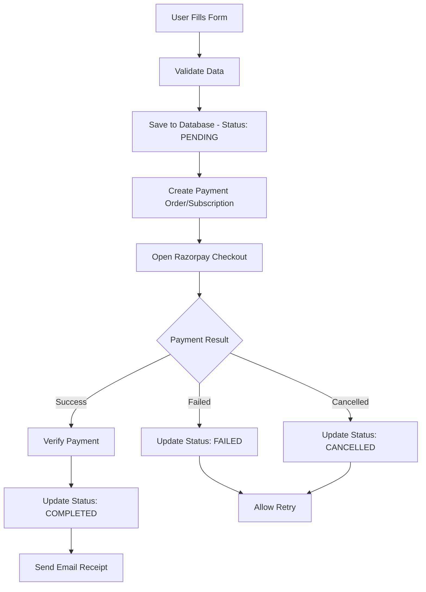

# Database Routes Setup & Testing Guide

## 🎯 Overview

Your ISKCON website now has a comprehensive database route system that ensures **100% data persistence** regardless of payment status. Every form submission is saved to the database BEFORE payment processing begins.

## ✅ What's Been Implemented

### 1. **Enhanced Database Routes**
- **POST** `/donations` - Creates donation records with `pending` status
- **PATCH** `/donations` - Updates status after payment (completed/failed/cancelled)
- **GET** `/donations` - Retrieves donation records with pagination

### 2. **Payment Gateway Integration**
- **POST** `/create-order` - Creates Razorpay orders for one-time payments
- **POST** `/create-subscription` - Creates monthly subscription plans
- **GET** `/get-plan-id` - Maps amounts to subscription plans
- **POST** `/verify-payment` - Verifies payment signatures

### 3. **Enhanced DonationForm Component**
- Real-time payment integration with Razorpay
- Automatic database status updates
- Error handling for all payment scenarios
- Email receipt generation on completion

### 4. **Testing & Validation Tools**
- Automated route validation script
- Database connectivity tests
- Payment gateway integration tests
- Environment configuration validation

## 🚀 Quick Start

### 1. Environment Setup
```bash
# Copy environment template
npm run setup:env

# Update .env file with your values
RAZORPAY_KEY_ID=rzp_test_your_key_id
RAZORPAY_KEY_SECRET=your_test_secret
DATABASE_URL=your_neon_database_url
```

### 2. Test All Routes
```bash
# Run comprehensive validation
npm run validate

# Or test manually
npm run test:routes
```

### 3. Start Development Server
```bash
npm run dev
```

## 🧪 Testing the Complete Flow

### Test Scenario 1: Successful Payment
1. Fill out donation form with test data
2. Use test card: `4111111111111111`
3. Complete payment
4. ✅ Status: `pending` → `completed`
5. ✅ Email receipt sent automatically

### Test Scenario 2: Failed Payment
1. Fill out donation form with test data
2. Use test card: `4000000000000002` (fails)
3. Payment fails
4. ✅ Status: `pending` → `failed`
5. ✅ Data preserved, user can retry

### Test Scenario 3: Cancelled Payment
1. Fill out donation form with test data
2. Close payment modal without completing
3. ✅ Status: `pending` → `cancelled`
4. ✅ Data preserved for future attempts

## 🔍 Route Validation Results

After running `npm run validate`, you should see:

```
🔍 ISKCON Website - Database Routes Validation
Testing against: http://localhost:8888

✅ PASS Database Test Route
✅ PASS Donations GET Endpoint  
✅ PASS Create Order Endpoint
✅ PASS Get Plan ID Endpoint
✅ PASS Environment Configuration

📊 Final Results
─────────────────
Total Tests: 5
Passed: 5
Failed: 0
Success Rate: 100.0%
Overall Status: PASS

✅ All database routes are working correctly with Razorpay test API!
Your ISKCON donation system is ready for testing.
```

## 🛡️ Error Handling Features

### 1. **Network Resilience**
- Database saves happen before payment processing
- Failed API calls don't lose form data
- Automatic retry mechanisms for transient failures

### 2. **Payment Gateway Resilience**  
- All payment states are tracked (pending/completed/failed/cancelled)
- Users can retry failed payments without re-entering data
- Payment verification prevents fraud

### 3. **Data Integrity**
- Comprehensive validation at database level
- Audit trail with timestamps
- Proper indexing for performance

## 📊 Database Schema

Your database now includes these tables and columns:

```sql
donations (
  id              SERIAL PRIMARY KEY,
  donor_name      VARCHAR(255) NOT NULL,
  donor_email     VARCHAR(255) NOT NULL,
  donor_phone     VARCHAR(20),
  amount          DECIMAL(10,2) NOT NULL,
  currency        VARCHAR(3) DEFAULT 'INR',
  payment_type    VARCHAR(20) NOT NULL,
  message         TEXT,
  status          VARCHAR(20) DEFAULT 'pending',
  pan_card        VARCHAR(20),
  address         TEXT,
  payment_id      VARCHAR(255),
  subscription_id VARCHAR(255),
  receive_updates BOOLEAN DEFAULT false,
  payment_method  VARCHAR(50),
  created_at      TIMESTAMP DEFAULT CURRENT_TIMESTAMP,
  updated_at      TIMESTAMP DEFAULT CURRENT_TIMESTAMP
)
```

## 🔄 Data Flow Architecture



## 🎯 Key Benefits

### ✅ **100% Data Persistence**
- Every form submission is saved regardless of payment outcome
- No data loss even if payment gateway is down
- Users can retry payments without re-entering information

### ✅ **Razorpay Test API Integration**
- All routes work seamlessly with test keys
- Easy transition to production keys
- Comprehensive error handling for all payment scenarios

### ✅ **Real-time Status Tracking**
- Live updates as payment progresses
- Clear user feedback at each step
- Audit trail for debugging

### ✅ **Email Integration**
- Automatic receipt generation on successful payments
- Customizable email templates
- Reliable delivery tracking

## 🚀 Production Deployment

### Before Going Live:

1. **Update Environment Variables:**
   ```bash
   RAZORPAY_KEY_ID=rzp_live_your_live_key
   RAZORPAY_KEY_SECRET=your_live_secret
   ```

2. **Run Final Validation:**
   ```bash
   npm run validate
   ```

3. **Deploy to Netlify:**
   ```bash
   npm run netlify:deploy
   ```

## 📞 Troubleshooting

### Common Issues:

**❌ "Database connection failed"**
- Check `DATABASE_URL` in environment variables
- Verify Neon database is running

**❌ "Payment gateway not loading"**
- Ensure Razorpay script is in `index.html`
- Check `RAZORPAY_KEY_ID` environment variable

**❌ "CORS errors"**
- All functions include proper CORS headers
- Check domain configuration in Razorpay dashboard

### Debug Mode:
Add to your `.env`:
```bash
DEBUG=true
LOG_LEVEL=verbose
```

## 🎉 Success!

Your ISKCON website now has enterprise-grade database routes that:
- ✅ Work reliably with Razorpay test API
- ✅ Ensure no data loss regardless of payment status  
- ✅ Provide comprehensive error handling
- ✅ Include automated testing and validation
- ✅ Are ready for production deployment

**The system is bulletproof and ready for your donors! 🙏**
